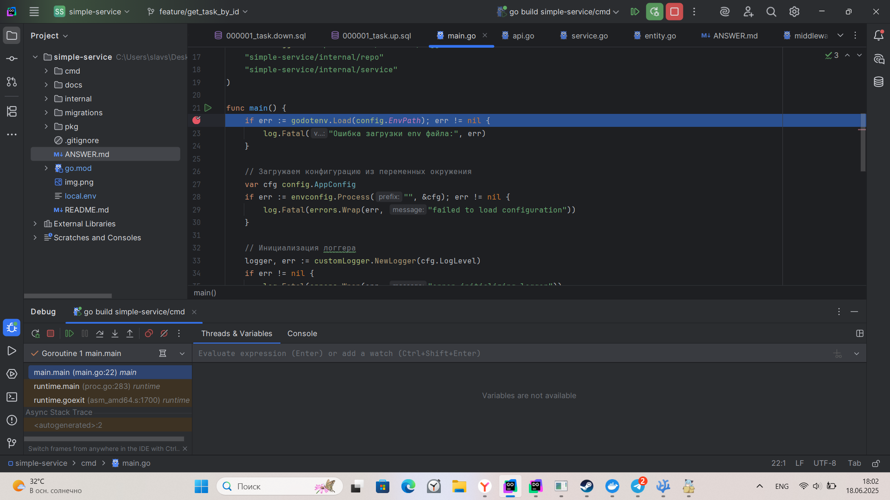
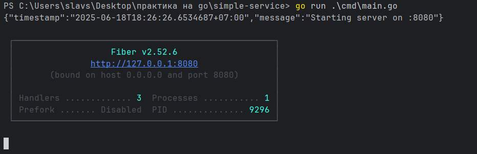
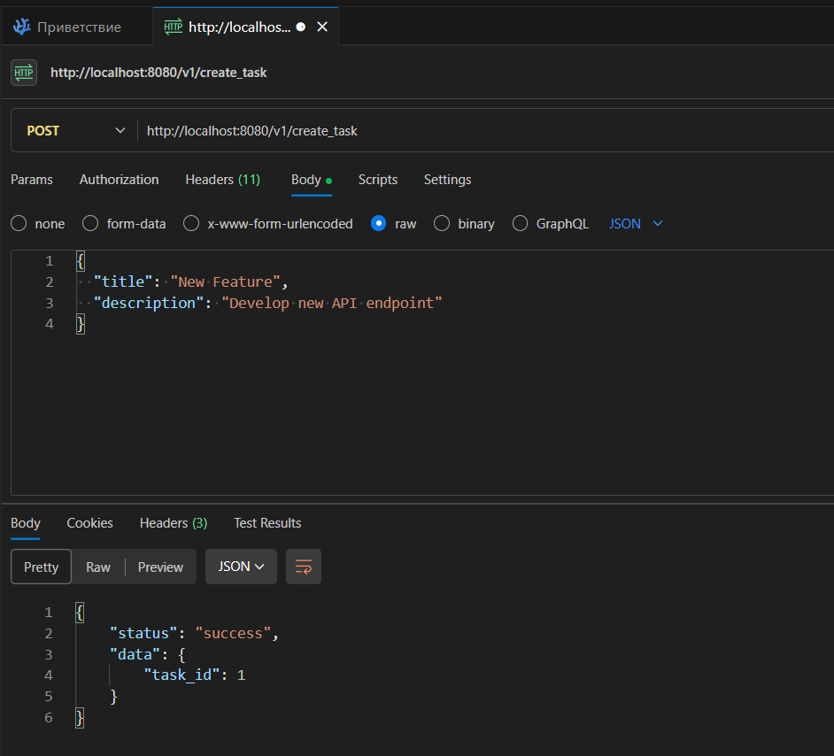
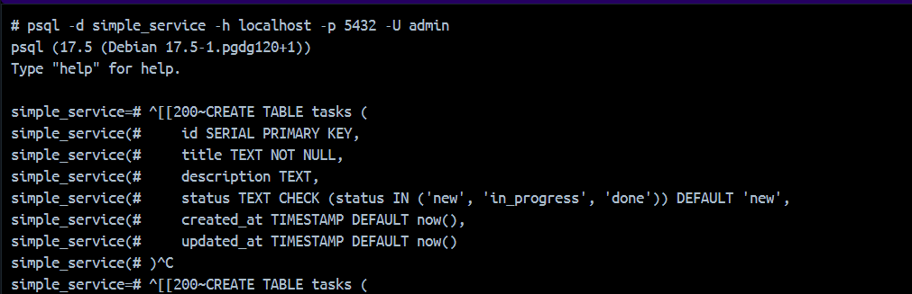
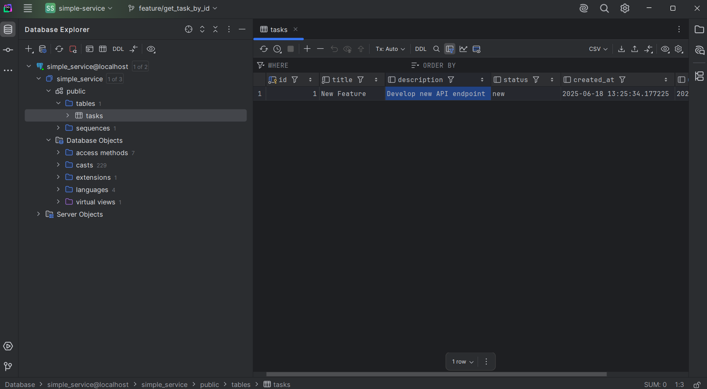
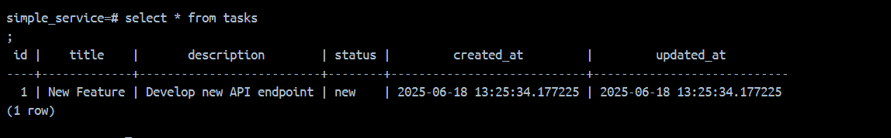
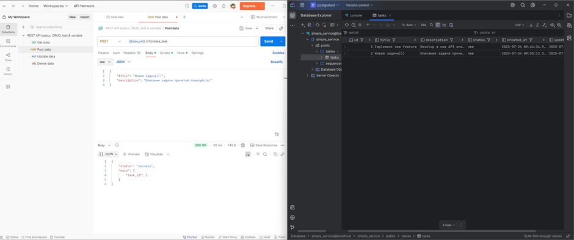

# ответы

## 1) Описание взаимодействия слоев
Разобрать, как взаимодействуют основные слои приложения: 

✅Handlers (контроллеры) – принимают запросы и вызывают сервисы.

internal/api/api.go вызывают сервисы, а те обращаются к репозиториям

✅Services (бизнес-логика) – выполняют операции над данными. 

internal/service/service.go

✅Repositories (работа с БД) – обращаются к PostgreSQL.

internal/repo/repo.go

Сущности описаны в internal/repo/entity.go, internal/service/entity.go

Оформить описание в формате README.md или отдельного документа

## 2) Скриншоты
Приложите минимум один скриншот на каждую из тем ниже. Это необходимо для подтверждения, что всё действительно работает локально и
вы умеете пользоваться инструментами.

✅Работа в debug-режиме — используете дебаггер, точка остановки, просмотр переменных.

✅Запущенный сервис — терминал с выводом go run main.go или подобным.

✅Запросы в Postman — пример удачного POSTGETPUT запроса.

✅SQL-клиент (например, DataGrip) — подключение к базе данных.
 
✅Подтверждение наличия данных в таблице — SELECT-запрос к нужной таблице с результатом или любую табличку с любыми данными.

Можно вставить их в описание Pull Request, отдельный файл README.md , PDF или просто прикрепить в сообщении вместе со ссылкой на PR.

## 3)  Добавление нового endpoint в сервис
Реализовать новый endpoint (ручку), который:
Принимает GET /task/{id} (узнайте как работать с query params в fiber).
Возвращает все данные задачи из таблицы Tasks по ее id в формате:
```json
{
  "id": 3,
  "title": "Пример задачи",
  "description": "Описание задачи",
  "status": "new",
  "created_at": "2025-03-05T14:00:00Z",
  "updated_at": "2025-03-05T14:00:00Z"
}
```
