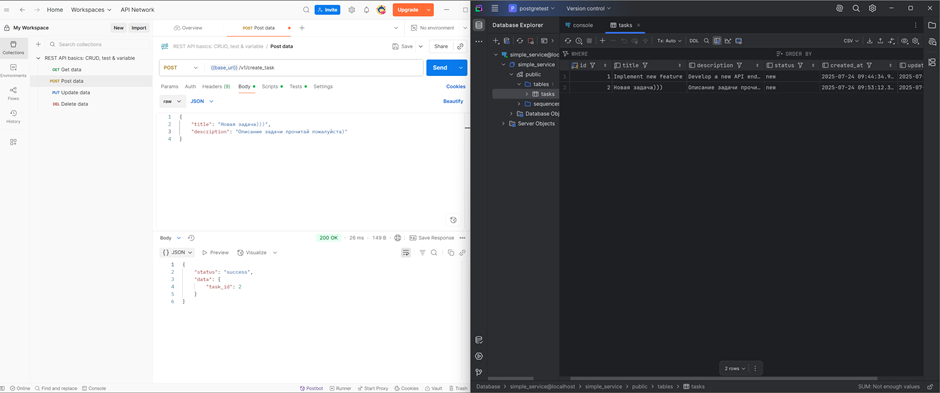
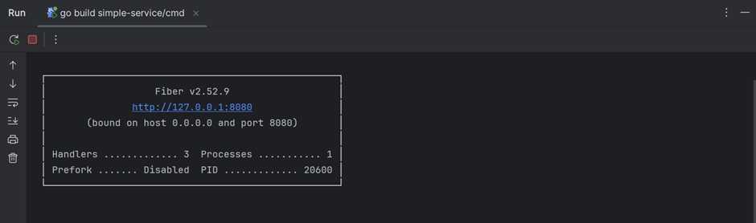
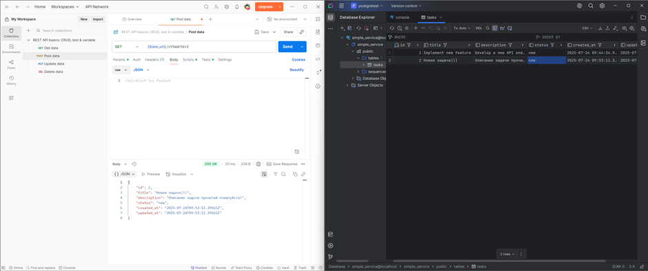
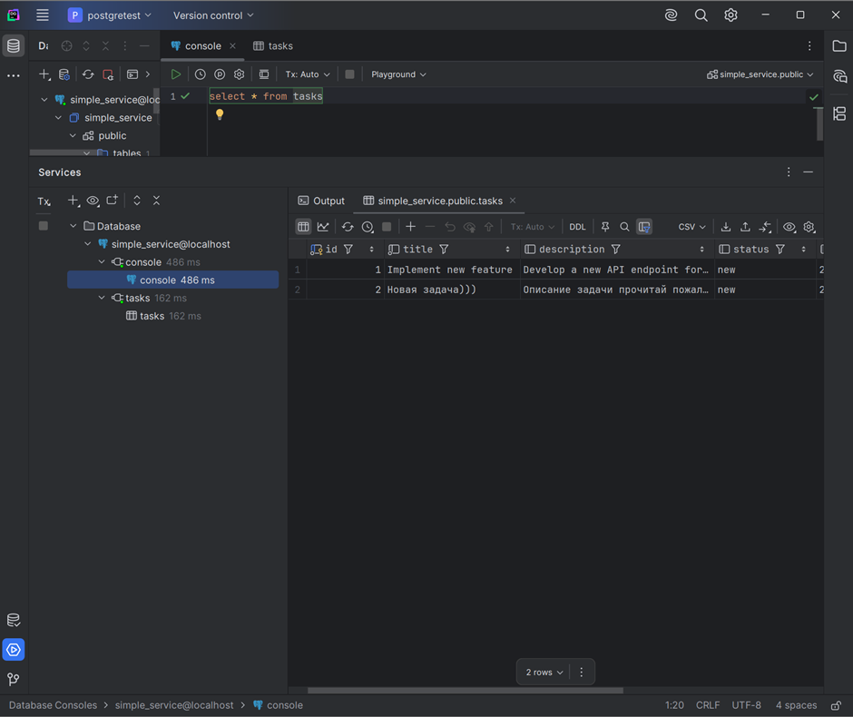

## 📸 Демонстрация

### ✅ Успешный POST-запрос в Postman

  

---

### 🚀 Успешный запуск сервера

  

---

### 🔍 Успешный GET-запрос в Postman

  

---

### 🐞 Работа в отладчике GoLand

  

---

### 🗄 Успешное подключение к PostgreSQL

  

---